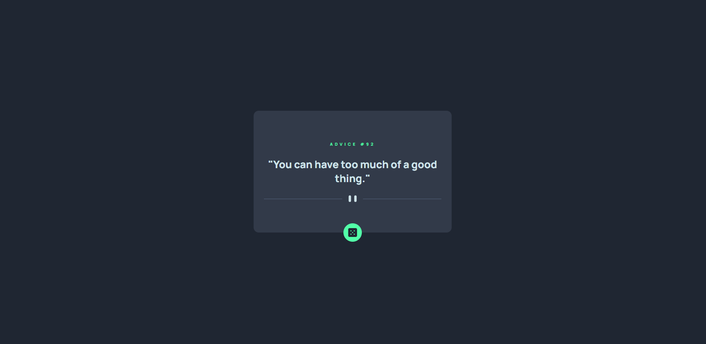
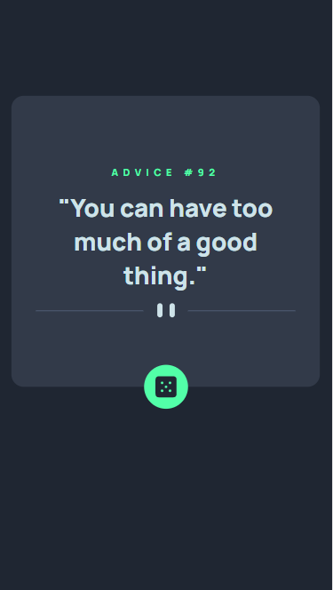

# Frontend Mentor - Advice generator app solution

This is a solution to the [Advice generator app challenge on Frontend Mentor](https://www.frontendmentor.io/challenges/advice-generator-app-QdUG-13db). Frontend Mentor challenges help you improve your coding skills by building realistic projects.

## Table of contents

- [Overview](#overview)
  - [The challenge](#the-challenge)
  - [Screenshot](#screenshot)
  - [Links](#links)
- [My process](#my-process)
  - [Built with](#built-with)
  - [What I learned](#what-i-learned)
  - [Continued development](#continued-development)
- [Author](#author)

## Overview

The application gives a new pice of advice fetching information from [Advice Slip Api](https://api.adviceslip.com/). The response is cached within 2 seconds, so the user might have the same advice if the dice icon is clicked within this timeframe

### The challenge

Users should be able to:

- View the optimal layout for the app depending on their device's screen size
- See hover states for all interactive elements on the page
- Generate a new piece of advice by clicking the dice icon

### Screenshot




### Links

- Solution URL: [FrontendMentor Link](https://www.frontendmentor.io/solutions/advice-generator-app-solution-hSTxbOwH66)
- Live Site URL: [Vercel Link](https://advice-generator-app-ebon.vercel.app/)

## My process

I tried to make this simple as possible. I built the application using only Vanilla JS to re-enforce some knowlege, CSS3 and HTML5

### Built with

- Semantic HTML5 markup
- CSS3
- Vanilla JS
- Desktop-first workflow
- [Vite](https://vitejs.dev/) - Frontend Tooling
- [Vercel](https://vercel.com/) - Deployment

### What I learned

Hover transitions over dice button

```css
.quote-button:hover{
  box-shadow: 0 0 20px hsl(150, 100%, 66%);
}
```

### Continued development

I would like to make improvements to the CSS markup. If the advice is too long, it takes over the div content and it looks ugly.

## Author

- Website - [Nadia Ujovich](https://nujovich.github.io/portfolio/)
- Frontend Mentor - [@nujovich](https://www.frontendmentor.io/profile/nujovich)
- Twitter - [@NUjovich](https://www.twitter.com/NUjovich)
